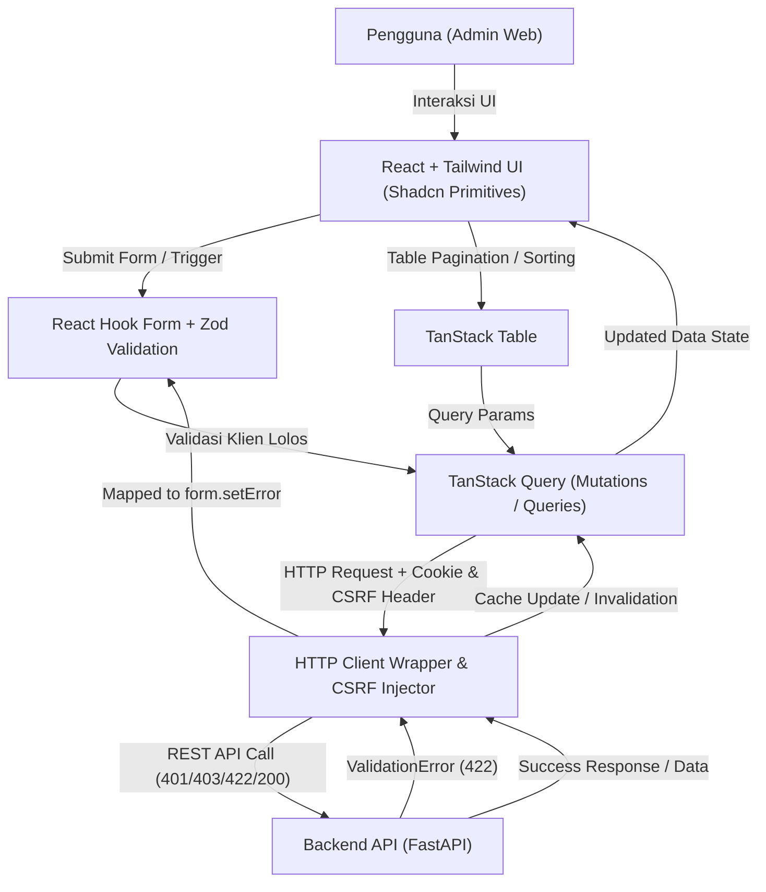

# 01 — Arsitektur Frontend

## Strategi Umum
Admin web dibangun sebagai aplikasi React yang menerapkan pola terstruktur, bukan kumpulan komponen acak. Tujuannya:
- mudah dikembangkan,
- mudah diuji,
- konsisten dengan API dan aturan backend,
- menghindari pengulangan logika di banyak tempat.

Frontend tidak boleh menjadi salinan API atau meniru pola domain backend secara harfiah. Frontend punya tanggung jawabnya sendiri: pengalaman pengguna, tampilan, aksesibilitas, dan koordinasi request klien. Rujukan lengkap terdapat pada [Dokumen 00 — Ikhtisar & Orientasi](00-frontend-overview.md).

## Pembagian Lapisan & Integrasi Stack Konkret
Frontend dipisah secara konseptual dan dihubungkan secara konkret dengan stack pilihan:

1. **Transport / API Layer & Auth**
   - HTTP client wrapper mengelola `credentials: 'include'` untuk session cookies.
   - Otomatis melakukan injeksi CSRF token header (`X-CSRF-Token` atau setara) pada mutasi (`POST`, `PUT`, `PATCH`, `DELETE`).
   - Penanganan error respons terpusat: HTTP `401 Unauthorized` memicu pembersihan sesi dan *redirect* otomatis ke halaman login; HTTP `403 Forbidden` menampilkan alert inline / toast peringatan tanpa logout paksa.
   - Sesuai dengan spesifikasi pada [Dokumen 05 — Kontrak API](05-api-contract.md) dan [Dokumen 12 — Spesifikasi Stack Definitif](12-stack-specification.md).

2. **Server State & Query Coordination Layer**
   - **TanStack Query** sebagai tulang punggung server state, caching, refetching, dan invalidasi mutasi.
   - Konvensi query keys terstruktur per feature (misal: `['users', { unitId, page, filters }]`) agar invalidasi cache tepat sasaran setelah operasi mutasi.
   - Koordinasi loading, error, dan empty state secara konsisten di seluruh modul.

3. **Form & Validation Layer (Bridging Arsitektur)**
   - Kombinasi **React Hook Form + Zod**.
   - **Arsitektur Bridging**: Validasi klien dijalankan terlebih dahulu menggunakan schema Zod sebelum submit payload ke backend. Jika backend merespons dengan HTTP 422 `ValidationError` (memuat detail error per field), interceptor / mutation error handler memetakannya secara otomatis langsung ke `form.setError(field, { message })` agar pesan kesalahan tampil presisi di bawah input form masing-masing.

4. **Data Presentation Layer**
   - **TanStack Table** digunakan untuk list data yang memerlukan server-side pagination, sorting, dan filtering.
   - Menyediakan abstraksi tabel yang konsisten di seluruh modul seperti manajemen pengguna ([Dokumen 02 — Modul Pengguna, Peran, & Unit](02-features-users-roles-units.md)) dan audit log ([Dokumen 03 — Modul Audit Log](03-audit-feature.md)).

5. **UI Component & Design Foundation**
   - **Tailwind CSS** + Headless primitives (mengikuti pola shadcn/radix) untuk komponen interaktif yang aksesibel.
   - Desain token, warna, spacing, radius, dan tipografi dikelola terpusat sesuai [Dokumen 08 — Panduan Tailwind CSS](08-tailwind-guidance.md).

Logika bisnis tingkat tinggi tetap berada di backend. Frontend memuat aturan presentasi, pengelompokan, kontrol visibilitas berdasarkan permission, dan penanganan error yang ramah pengguna.

## Alur Data Ujung-ke-Ujung (End-to-End Data Flow)
Diagram Mermaid berikut menggambarkan alur data dari interaksi pengguna hingga komunikasi backend:

## Server State vs Client State
Pola yang disarankan:
- **Server state**: data yang punya sumber kebenaran di backend, seperti daftar user, role, unit, audit log. Ini dikelola oleh TanStack Query.
- **Client state**: hal yang bersifat sementara dan lokal, seperti form draft, pilihan filter sementara, unit yang sedang dipilih, status toast, state loading lokal yang tidak perlu sync ke server.

Jangan pakai TanStack Query untuk sembarangan state yang tidak punya sumber kebenaran; gunakan state lokal, context, atau penyimpanan ringan sesuai kebutuhan.

## Layout dan Navigation
Admin web sebaiknya punya:
- header atau area utama yang stabil
- navigasi utama (sidebar atau top nav)
- area konten per halaman

Navigasi harus:
- mengikuti bounded context yang ada di backend
- dikendalikan oleh permission/effective access, bukan teks role yang dipaksa
- mampu merespons perubahan sesi atau konteks tanpa perilaku aneh

## Unit Context
Karena assignment user bisa scoped per unit dan bisa global, aplikasi web harus menyimpan unit context saat ini dan menggunakannya untuk:
- membatasi layar list yang terikat unit
- menentukan scope pada aksi yang memerlukan unit
- menampilkan konteks yang terlihat oleh user

Unit switcher di header adalah elemen yang wajib ada, bukan opsional. Rincian modul tersedia di [Dokumen 02 — Modul Pengguna, Peran, & Unit](02-features-users-roles-units.md).

## Error Handling Strategy
Strategi penanganan error, pemetaan kode error standar, penanganan HTTP 401/403, serta korelasi `request_id` sepenuhnya merujuk pada Single Source of Truth (SSOT) di [Dokumen 05 — Kontrak API](05-api-contract.md) dan [Dokumen 04 — Praktik Terbaik UI/UX](04-uiux-best-practices.md).

## Struktur Folder Konseptual
Pemisahan lapisan arsitektur frontend diorganisasikan secara modular berbasis feature. Rincian pohon struktur folder, hierarki direktori, dan konvensi file sepenuhnya dimiliki dan dikelola oleh [Dokumen 10 — Struktur Folder Frontend](10-frontend-folder-structure.md) sebagai satu-satunya Single Source of Truth (SSOT) struktur folder frontend.

## Apa yang Tidak Boleh Dilakukan
- Menyembunyikan fitur dan menganggap itu cukup untuk keamanan ([Dokumen 09 — Aturan & Konvensi Kode](09-coding-rules.md)).
- Membangun semua UI sebelum struktur navigasi dan error mapper jadi.
- Memperkirakan semua layar state tanpa pagination, loading, dan empty state.
- Mencampur banyak library visual tanpa menetapkan fondasi desain ([Dokumen 11 — Tooling & Biome](11-tooling-and-biome.md)).
- Mengabaikan CSRF atau error shape standar.

---
⬅ **Sebelumnya:** [Dokumen 00 — Ikhtisar & Orientasi](00-frontend-overview.md) | 📑 **[Indeks Dokumen](README.md)** | ➡ **Selanjutnya:** [Dokumen 02 — Modul Pengguna, Peran, & Unit](02-features-users-roles-units.md)
